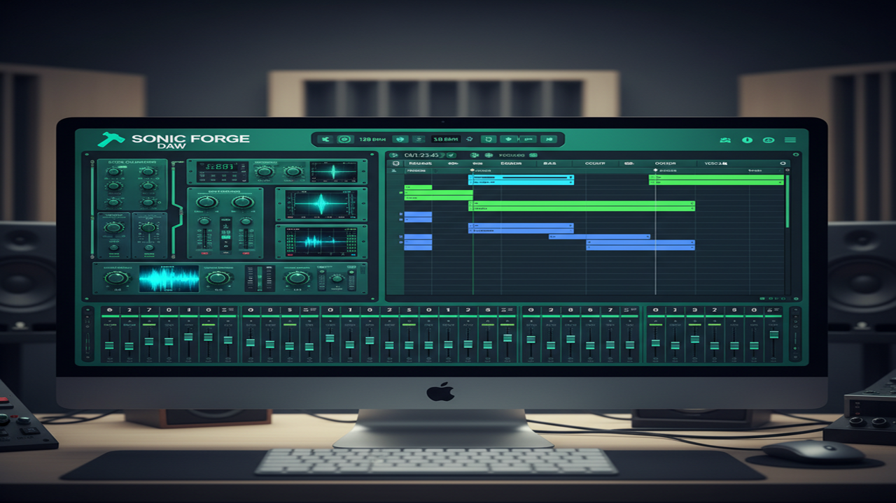

# Sonic Forge ⚡

**Professional Audio Mastering in the Browser.**

Sonic Forge is a local-first Progressive Web App (PWA) designed to bring desktop-class audio engineering to the web. By leveraging **AudioWorklets** for real-time processing and **Zig/WebAssembly** for heavy offline computation, it delivers a zero-latency, high-fidelity experience without uploading your data to the cloud.



## ✨ Key Features

### 🎛️ Real-Time Effects Rack
Build your mastering chain with a suite of professional modules. Drag and drop to reorder.
*   **Dynamics:** Compressor, Multiband Compressor, Limiter, Transient Shaper, De-Esser.
*   **EQ & Filters:** Parametric EQ, Dynamic EQ, Mid/Side EQ, AutoWah.
*   **Color & Saturation:** Tube Saturation, Distortion, Bitcrusher, Tape/Cab Sim.
*   **Modulation & Space:** Chorus, Phaser, Tremolo, Feedback Delay, Stereo Imager.
*   **Metering:** LUFS Loudness Meter, True Peak detection.

### 🧠 Smart Processing (Zig/WASM)
A dedicated "Smart Tools" panel powered by a high-performance **Zig** engine compiled to **WebAssembly**.
*   **Loudness Normalization:** Precisely target -14 LUFS, -23 LUFS, or custom values (EBU R128).
*   **Phase Rotation:** Recover headroom by correcting asymmetric waveforms (smearing transients).
*   **De-Clipper:** Repair digital clipping artifacts using cubic interpolation.
*   **Spectral Denoise:** Intelligent FFT-based background noise reduction.
*   **Mono Bass:** Ensure mix compatibility by mono-summing frequencies below a target (e.g., 120Hz).

### 🎚️ Multi-Track Mixer
*   **Track Control:** Individual Volume, Pan, Mute, and Solo for multiple audio tracks.
*   **Master Bus:** Global processing chain for final glue and limiting.
*   **Visualization:** Real-time RMS and Peak metering.

### 🔒 Local-First & Privacy
*   **No Cloud Processing:** All DSP runs locally on your device.
*   **Persistence:** Projects and audio files are automatically saved to your browser's IndexedDB.
*   **Offline Capable:** Install as a PWA and use without an internet connection.

## 🚀 Getting Started

### Prerequisites
*   **Node.js 18+**
*   **Zig 0.13.0+** (Only required if you intend to modify/build the WASM modules)

### Installation

1.  **Clone the repository:**
    ```bash
    git clone https://github.com/ray0404/SonicForge.git
    cd sonic-forge
    ```

2.  **Install dependencies:**
    ```bash
    npm install
    ```

3.  **Build the WASM engine:**
    ```bash
    npm run build:wasm
    ```

4.  **Start the development server:**
    ```bash
    npm run dev
    ```

5.  **Open:** Navigate to `http://localhost:5173`.

## 🧩 Workflows

### The "Smart Processing" Panel
The Smart Processing tools operate in two distinct modes to fit your workflow:

1.  **Project Track Mode:**
    *   Select a track from your current project.
    *   Apply processes destructively to the track's source audio.
    *   Use the **Undo/Redo** buttons to experiment safely.

2.  **External File Mode:**
    *   Upload an audio file directly from your device.
    *   Apply chainable processes (e.g., Denoise -> Normalize).
    *   **Preview:** Scrub through the timeline to hear the results instantly.
    *   **Download:** Export the processed WAV file without importing it into your project.

## 🛠️ Architecture for Developers

*   **State:** `Zustand` stores the "Intent" (UI state).
*   **Orchestration:** `AudioEngine` (`packages/sonic-core/src/mixer.ts`) subscribes to the store and manages the Web Audio Graph.
*   **Real-time DSP:** `AudioWorklets` (`packages/sonic-core/src/worklets/`) run in the Audio Thread for glitch-free playback.
*   **Offline DSP:** `Zig` code (`packages/sonic-core/src/dsp/zig/`) is compiled to WASM and runs in a Web Worker for heavy lifting.

## 🏗️ Build Commands

| Command | Description |
| :--- | :--- |
| `npm run dev` | Start local dev server (Vite). |
| `npm run build` | Build the web application for production. |
| `npm run build:wasm` | Compile Zig source to `public/wasm/dsp.wasm`. |
| `npm run build:cli` | Build the headless CLI tool. |
| `npm test` | Run unit tests (Vitest). |

## 📄 License

MIT